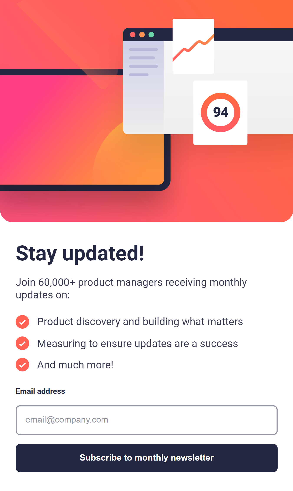

# Newsletter Sign-up Form with Success Message

This is a solution to the "Newsletter sign-up form with success message" challenge on Frontend Mentor. Frontend Mentor challenges help you improve your coding skills by building realistic projects.

## Overview

The "Newsletter Sign-up Form with Success Message" project aimed to create a functional and visually appealing web page that allows users to subscribe to a newsletter. The primary objectives were to implement a responsive design, real-time form validation, and a success message upon successful submission.

### Key Features

- **Responsive Design**: The project adopted a mobile-first approach, ensuring that the layout and content are optimized for various screen sizes, from mobile devices to larger desktop screens.

- **Form Validation**: The sign-up form includes client-side validation using HTML5 attributes like `required` and `pattern` on the email input field. JavaScript was also employed to enhance validation and provide immediate feedback to users.

- **Dynamic Content**: Upon successful submission of a valid email address, the project dynamically displays a personalized success message that includes the user's email.

- **User Experience**: Hover and focus styles were incorporated for interactive elements to create a more engaging and visually appealing user experience.

### Technologies Used

- **HTML5**: The project's structure and content are built using semantic HTML5 markup, ensuring accessibility and SEO-friendliness.

- **CSS3**: Cascading Style Sheets were employed to style the web page, including the use of CSS custom properties for consistent color management.

- **JavaScript**: JavaScript was utilized to implement real-time form validation and handle the dynamic display of the success message.

### Challenges Faced

While working on this project, a few challenges were encountered. These challenges mainly revolved around form validation and ensuring a seamless transition from the main content to the success message upon submission.

### Lessons Learned

The project provided an opportunity to reinforce skills in HTML, CSS, and JavaScript. It highlighted the importance of creating responsive layouts and maintaining a user-friendly experience, especially in web forms. Form validation techniques and DOM manipulation were also areas of learning and improvement.

### Future Enhancements

In the future, there's potential to further enhance the project by implementing additional features, such as server-side validation, integration with a database for storing email addresses, and more advanced user interactions.

Overall, the "Newsletter Sign-up Form with Success Message" project was a valuable learning experience that allowed for the application of fundamental web development skills and the exploration of user-centric design principles.

### The Challenge

The challenge involved creating a newsletter sign-up form with the following requirements:

- Allow users to input their email and submit the form.
- Display a success message with their email after successfully submitting the form.
- Show form validation messages if:
  - The field is left empty.
  - The email address is not formatted correctly.
- Ensure the layout is responsive for different screen sizes.
- Apply hover and focus states for interactive elements on the page.

### Screenshot

## My Process

### Overview

For the "Newsletter Sign-up Form with Success Message" project, my goal was to create a responsive and user-friendly sign-up form that provides real-time validation feedback and displays a success message upon successful submission. Here's a breakdown of my process:

### Building the Structure

I started by setting up the basic HTML structure, using semantic tags and organizing the content into sections. This included creating two articles for the main content and the success message, respectively. I also incorporated forms and input elements for user interaction.

### Styling with CSS

With the HTML structure in place, I proceeded to style the page using CSS. I utilized custom properties for consistent color management and followed a mobile-first approach, ensuring the layout looked good on small screens. CSS Grid and Flexbox were employed to create a visually appealing and responsive design.

### Adding Form Validation

To implement form validation, I used HTML5 attributes like `required` and `pattern` on the email input field. This provided basic client-side validation. Additionally, I wrote JavaScript to enhance validation further and provide real-time feedback. When users submit the form with invalid input or leave fields empty, error messages are displayed, and input fields are highlighted.

### Displaying Success Message

Upon successful form submission, I utilized JavaScript to hide the main content article and reveal the success message article. The user's email address was dynamically inserted into the success message to personalize it.

### Enhancing User Experience

To improve the user experience, I added hover and focus styles for interactive elements, ensuring they respond visually to user interactions. This makes the form feel more interactive and engaging.

### Conclusion

Working on this project allowed me to strengthen my skills in HTML, CSS, and JavaScript, particularly in the areas of form validation and dynamic content manipulation. I also gained experience in creating responsive layouts that adapt to various screen sizes.

In future projects, I plan to explore more advanced JavaScript techniques and further refine my CSS skills to create even more polished and interactive web applications.

### Built With

- Semantic HTML5 markup
- CSS custom properties
- Flexbox
- Mobile-first workflow
- JavaScript for form validation and interactivity

### What I Learned

While working on this project, I learned how to:

- Create a responsive layout using CSS Flexbox and Grid.
- Implement form validation using JavaScript.
- Update content dynamically based on user input.
- Apply hover and focus styles to enhance user experience.

### Continued Development

In future projects, I plan to further improve my knowledge of JavaScript for enhancing interactivity and explore more advanced CSS and JS techniques for creating visually appealing designs.

## Author

- [AnoshaSohai](https://github.com/AnoshaSohai)
- Frontend Mentor - [@AnoshaSohail](https://www.frontendmentor.io/profile/AnoshaSohail)

